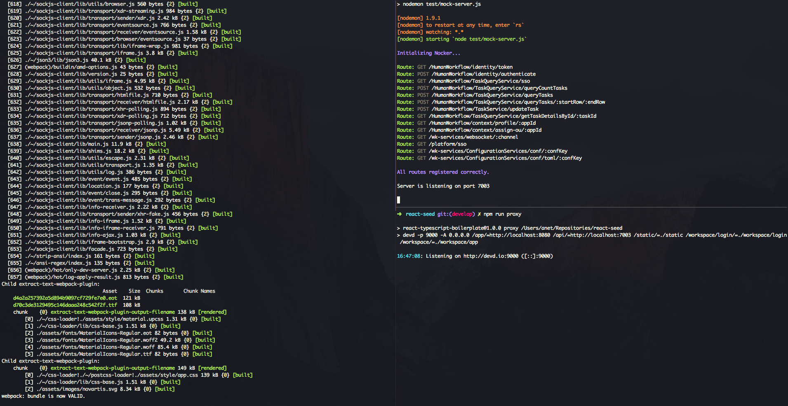

Getting Started
---------------

* ensure [node](http://nodejs.org) is installed
* ensure [devd](https://github.com/cortesi/devd) is installed
* `npm install` downloads dependencies
* `npm start` launches the development environment
  * The application serves at http://localhost:9000/workspace/login
  * Available users: ***jlondon*, *jcooper*, *jstein***
  * Password is **welcome1**

Check **package.json** for the available scripts in this repo

-----------------

For a more sophisticated developing experience, install **tmux** and use it to have all terminals multiplexed.

